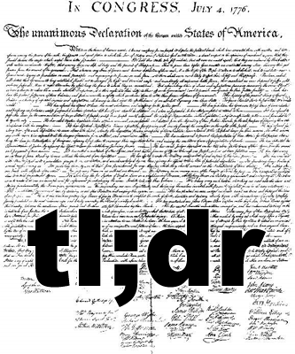

# Spring 2017
# Project 1: What did the presidents say at their inauguation?




### [Project Description](doc/)

Author: Sean Reddy

Term: Spring 2017

+ Project Title: TL;DR: Inaugural Speeches

+ Project summary:

With some inaugural speeches spanning almost two hours and nearly 8500 words of exceptionally verbiose rhetoric, it can be difficult to properly digest the meaning behind a president-elect's induction address. In this project, I sought out to ameliorate this problem for every presidential inauguration speech by creating, what's known on the internet as, a TL;DR.

What does TL;DR mean? TL;DR is a commonly used acronym on the internet for "Too Long; Didn't Read" which indicates that a passage of text was so long that the user cannot be bothered to read and sift through it. The acronym is colloquially used as a noun to define a summarized version of the aforementioned passage of text. This tool provides a TL;DR for all of the inauguration speeches from the inception of the United States of America.


This folder is organized as follows.

```
proj/
├── lib/
├── data/
├── doc/
├── figs/
└── output/
```

Please see each subfolder for a README file.
